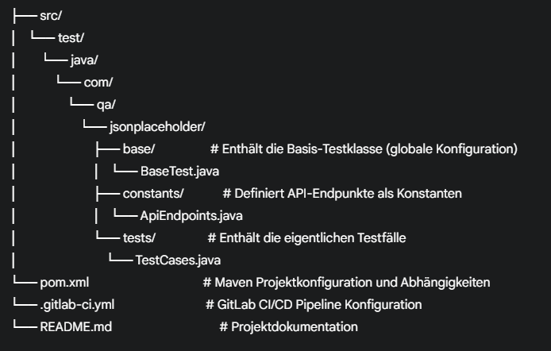

# API Testautomatisierung mit Rest Assured & JUnit 5

## Projektübersicht
Dieses Projekt demonstriert die automatisierte Testautomatisierung von RESTful APIs unter Verwendung von Java, Maven, Rest Assured und JUnit 5. Es zielt darauf ab, die Funktionalität verschiedener HTTP-Methoden (GET, DELETE, POST, PUT, PATCH) auf mehreren Ressourcen der [JSONPlaceholder API](https://jsonplaceholder.typicode.com/) zu validieren.

## Verwendete Technologien
* **Java:** Programmiersprache
* **Maven:** Build-Automatisierung und Dependency Management
* **Rest Assured:** Java-Bibliothek für das Testen von RESTful APIs
* **JUnit 5:** Testing Framework

## Projektstruktur
Das Projekt folgt einer schlanken Best-Practice-Struktur, um Wartbarkeit und Übersichtlichkeit zu gewährleisten:

## Testfälle
Die `TestCases.java`-Klasse enthält 5 automatisierte Testfälle, die folgende Szenarien abdecken:
1.  **GET Comments:** Abrufen aller Kommentare.
2.  **DELETE Comment:** Löschen eines bestimmten Kommentars.
3.  **POST Comment:** Erstellen eines neuen Kommentars (simuliert die Neuanlage nach dem Löschen).
4.  **PUT Todo:** Vollständige Aktualisierung eines bestehenden To-Do-Eintrags.
5.  **PATCH Todo:** Partielle Aktualisierung eines bestehenden To-Do-Eintrags.

Die Tests geben detaillierte Informationen (Request Body, Response Status, Response Body) in der Konsole aus.

## Ausführung der Tests
* Die Tests lassen sich direkt in IntelliJ IDEA ausführen oder alternativ über Maven im Terminal starten.
* Das Projekt ist für GitLab CI/CD konfiguriert. Ein test-Job wird bei jedem Push über die .gitlab-ci.yml ausgeführt – basierend auf einem Maven-Docker-Image. Testergebnisse sind unter CI/CD → Pipelines im GitLab-Projekt einsehbar.